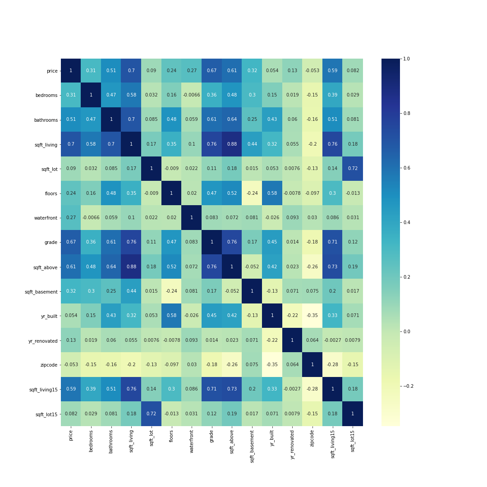
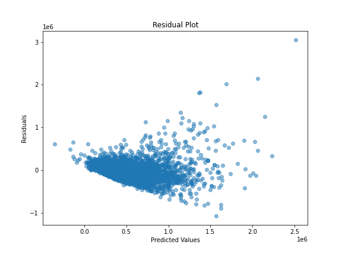
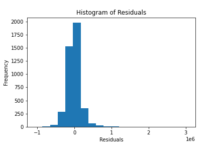
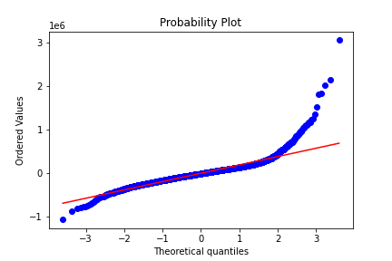

<link rel="stylesheet" href="readme.css">


<h1 style="text-align: center;">PRO REALTY REAL ESTATE INVESTOR </h1>

### PROJECT OVERVIEW 

Welcome to the Pro realty real estate investor House Price Prediction project. The main objective of this project is to develop a hardy multiple linear regression model capable of predicting house prices based on a set of key features. By making use of  machine learning techniques, we aim to provide valuable insights into the factors influencing real estate prices.

### FEATURES

id :a notation for a house

date: Date house was sold

price: Price is prediction target

bedrooms: Number of Bedrooms/House

bathrooms: Number of bathrooms/bedrooms

sqft_living: square footage of the home

sqft_lot: square footage of the lot

floors :Total floors (levels) in house

waterfront :House which has a view to a waterfront

view: Has been viewed

condition :How good the condition is Overall

grade: overall grade given to the housing unit, based on King County grading system

sqft_above :square footage of house apart from basement

sqft_basement: square footage of the basement

yr_built :Built Year

yr_renovated :Year when house was renovated

zipcode:zip code

lat: Latitude coordinate

long: Longitude coordinate

sqft_living15 :Living room area in 2015(implies-- some renovations) This might or might not have affected the lotsize area

sqft_lot15 :lotSize area in 2015(implies-- some renovations)

### BUSINESS PROBLEM.
Pro Realty, a leading real estate firm, is poised for expansion and aspires to solidify its position as the premier real estate investor. To achieve this goal, Pro Realty recognizes the critical need to optimize its Return on Investment (ROI). The company aims to leverage the vast potential within the King County dataset to seeks strategic insights and data-driven solutions to enhance decision-making, identify lucrative investment opportunities, and ultimately maximize ROI. How can Pro Realty harness the power of the King County dataset to inform its expansion strategy, mitigate risks, and position itself as a dominant force in the real estate market.

### STAKE HOLDER(PRO REALTY) OBJECTIVES.
1.Identify factors influencing house prices in King County.

2.Predict housing prices with high accuracy.

3.Make informed investment decisions by targetting properties with high potential returns.

4.Minimise risk by avoiding overpaying for properties.

5.Optimize portfolio diversification by investing in different neighbourhoods and property types.

You will require the following libraries
```
import pandas as pd
import matplotlib.pyplot as plt
import numpy as np
%matplotlib inline
import seaborn as sns
import mpl_toolkits
import statsmodels.api as sm
import calendar
import warnings 
warnings.filterwarnings('ignore')
from sklearn.linear_model import LinearRegression
from sklearn.model_selection import train_test_split
from sklearn.metrics import mean_squared_error, r2_score
from sklearn import ensemble
from sklearn.preprocessing import scale
from sklearn.decomposition import PCA

```
1.By observing the correlation heatmap we are able to see  how the various variables presented in our dataset are affecting housing prices .




Strongest Positive Correlations with Price:
.sqft_living (0.702): Suggests a strong positive relationship between house price and living space, indicating larger homes tend to have higher prices.
.grade (0.667): Higher-grade homes (likely reflecting better quality and features) generally have higher prices. .bathrooms (0.525): Suggests homes with more bathrooms tend to have higher prices.
.sqft_above (0.606): This reflects that above-ground living area is a significant factor influencing price.

Moderate Positive Correlations with Price:
.sqft_living15 (0.585): This suggests living space in the surrounding area is also somewhat correlated with price.
.view (0.397): Homes with better views tend to have higher prices.
.bedrooms (0.308): More bedrooms are associated with higher prices, but the correlation is less strong than other factors.

Weak or No Correlation with Price:
.id: the house ID is not informative for price prediction.
.sqft_lot (0.089): Lot size has a very weak correlation with price.
.yr_built (0.054): Year built has minimal correlation with price

### explore categorical features

```
print(df['waterfront'].value_counts())
print(df['condition'].value_counts())
print(df['grade'].value_counts())

```
from the above arrived at the decision to one-hot encoding for Waterfront column

```
df = pd.read_csv('kc_house_data.csv')
# Select the categorical features to encode
categorical_features = ['waterfront']

# One-hot encode the features
df = pd.get_dummies(df, columns=categorical_features, drop_first=True)

# Print the encoded DataFrame to see the new columns
df.head()

```
proceeded drop the following columns 

```
# Specify columns to drop as a list
columns_to_drop = ['date', 'view', 'sqft_basement', 'yr_renovated', 'zipcode', 'lat', 'long', 'sqft_living15', 'sqft_lot15']  

# Drop the columns
df = df.drop(columns_to_drop, axis=1)

# Verify the updated DataFrame
print(df.head())  
print(df.columns)

```

### MODEL BUILDING AND PREDICTION

#### SIMPLE LINEAR REGRESSION

```
y = df['price']  
features = ['sqft_living']  
# Define features
X = df[features]  # Extract feature matrix

X_train, X_valid, y_train, y_valid = train_test_split(X, y, test_size=0.2, random_state=0)  # Split data

model = LinearRegression(fit_intercept=True)  # Create model instance
model.fit(X_train, y_train)  # Train the model

preds = model.predict(X_valid)  # Make predictions on validation set

```
```
mse = mean_squared_error(y_valid, preds)
r2 = r2_score(y_valid, preds)
print("Mean squared error:", mse)
print("R-squared:", r2)

```
```
Mean squared error: 61940787124.624756
R-squared: 0.4791577237265374
````


#### MULTIPLE LINEAR REGRESSION

```
correlation_matrix = df.corr()
correlation_with_price = correlation_matrix['price'].abs().sort_values(ascending=False)
print(correlation_with_price)
```
```
y = df['price']  
features = ['bedrooms', 'bathrooms', 'sqft_living', 'sqft_lot',
       'floors', 'condition', 'grade', 'sqft_above', 'yr_built', 'waterfront_1']  
# Define features
X = df[features]  # Extract feature matrix

X_train, X_valid, y_train, y_valid = train_test_split(X, y, test_size=0.2, random_state=0)  # Split data

model = LinearRegression(fit_intercept=True)  # Create model instance
model.fit(X_train, y_train) # Train the model

preds = model.predict(X_valid)
```

```
Mean squared error: 43056428188.69171
R-squared: 0.6379508703871847
```
### Residual calculations 

Residual calculations  measure how much the model's predictions vary from the true values.this offers valuable insights into model performance and potential areas for improvement. It can also help identify patterns in errors, suggesting model refinements.







```
#linear regression model
coefficients = model.coef_
intercept = model.intercept_

# Print coefficients and intercept
print("Intercept:", intercept)
print("Coefficients:", dict(zip(features, coefficients)))

```
This equation allows us to understand how changes in the features influence the predicted price.one such example is Sqft_living: For each additional square foot of living space, the predicted price increases by approximately 193.61.

From the above analysis the following are our key features;
Grade

Waterfront

Bathrooms

sqft_living

floors

### RECOMMENDATIONS

Consider the above key features as having te biggest positive impact on predicted prices therefore potentially increasing Pro Realty's ROI(return on investment)

### CONCLUSION
The multiple linear regression model between the various features and price provides an insight into how changes in feature in turn affects changes in predicted prices,However we should acknowledge the limitations of the model.While it captures linear relationships , it may not capture complex interactions between features.So Pro Realty should continue the refinement of the model by exploring additional features in the subsequent years as well as adopting Advanced techniques.


